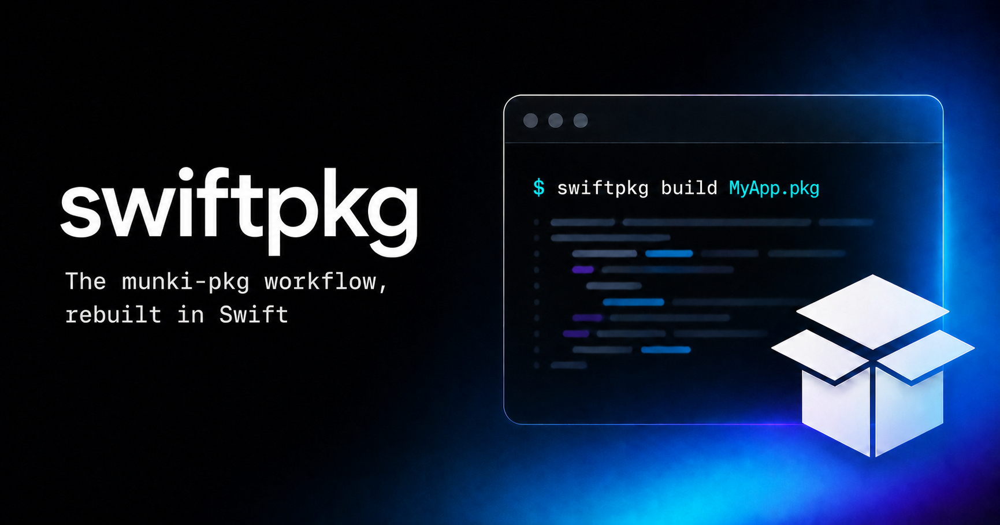

# swiftpkg

[](https://github.com/codecarton/swiftpkg/actions/workflows/ci.yml)
[](https://github.com/codecarton/swiftpkg/releases)
[](LICENSE)
[](https://support.apple.com/macos)
[](https://support.apple.com/macos)

`swiftpkg` is a macOS command-line tool for building Apple installer packages
from version-control-friendly project directories. It is a Swift implementation
of [`munki-pkg`](https://github.com/munki/munki-pkg). `Swiftpkgr` is its native
macOS desktop app. Both frontends use the same `SwiftPkgCore` package engine and
open the same portable projects.

## Quick start

Install the CLI and desktop app independently from the official
[`codecarton/homebrew-tap`](https://github.com/codecarton/homebrew-tap):

```sh
brew install codecarton/tap/swiftpkg
brew install --cask codecarton/tap/swiftpkgr
swiftpkg --version
```

The `swiftpkg` formula requires macOS 13 or later. The `swiftpkgr` cask requires
macOS 15 or later and installs `Swiftpkgr.app` in `/Applications`.

Create and build your first package project:

```sh
swiftpkg --create MyPackage
swiftpkg MyPackage
```

Open `MyPackage` in Swiftpkgr whenever you want to edit or build the same
project visually. Keep both tools current through Homebrew:

```sh
brew update
brew upgrade swiftpkg
brew upgrade --cask swiftpkgr
```

Remove either tool independently:

```sh
brew uninstall swiftpkg
brew uninstall --cask swiftpkgr
```

## Signed release downloads

The signed and notarized
[swiftpkg 0.3.1 release](https://github.com/codecarton/swiftpkg/releases/tag/v0.3.1)
provides these immutable resources:

- [`swiftpkg-0.3.1-combined.pkg`](https://github.com/codecarton/swiftpkg/releases/download/v0.3.1/swiftpkg-0.3.1-combined.pkg)
  installs both the CLI and Swiftpkgr and requires macOS 15 or later.
- [`swiftpkg-0.3.1-cli.pkg`](https://github.com/codecarton/swiftpkg/releases/download/v0.3.1/swiftpkg-0.3.1-cli.pkg)
  installs only the CLI and requires macOS 13 or later.
- [`Swiftpkgr-0.3.1.zip`](https://github.com/codecarton/swiftpkg/releases/download/v0.3.1/Swiftpkgr-0.3.1.zip)
  contains only the macOS 15+ app.
- [`swiftpkg-0.3.1-universal.tar.gz`](https://github.com/codecarton/swiftpkg/releases/download/v0.3.1/swiftpkg-0.3.1-universal.tar.gz)
  is the Universal 2 CLI archive consumed by the Homebrew formula.
- [`SHA256SUMS`](https://github.com/codecarton/swiftpkg/releases/download/v0.3.1/SHA256SUMS)
  covers every downloadable release artifact.

Verify a package download before installation:

```sh
grep ' swiftpkg-0.3.1-combined.pkg$' SHA256SUMS | shasum -a 256 -c -
pkgutil --check-signature swiftpkg-0.3.1-combined.pkg
xcrun stapler validate swiftpkg-0.3.1-combined.pkg
sudo installer -pkg swiftpkg-0.3.1-combined.pkg -target /
swiftpkg --version
```

The combined installer places the executable at `/usr/local/bin/swiftpkg` and
the app at `/Applications/Swiftpkgr.app`. Deploy that artifact through Munki,
Jamf Pro, or another management system; do not repackage its contents. Use the
CLI package when managed Macs do not need the app. The ZIP can be expanded and
`Swiftpkgr.app` moved to `/Applications` for an app-only installation.

To uninstall a package-based installation, remove `/usr/local/bin/swiftpkg` and
`/Applications/Swiftpkgr.app`, then optionally forget the
`com.codecarton.swiftpkg.installer` or
`com.codecarton.swiftpkg.cli.installer` receipt after confirming it is not
needed for inventory.

`swiftpkg` requires macOS, Xcode Command Line Tools, and Apple's `pkgbuild`,
`productbuild`, `pkgutil`, `ditto`, and `lsbom` tools. Package signing and
notarization additionally require the appropriate Apple credentials on the
build host.

## Swiftpkgr desktop app

Swiftpkgr provides a focused visual workspace for creating, importing, editing,
building, signing, and notarizing package projects. Open the same
`build-info.plist`, `.json`, `.yaml`, or `.yml` projects in either Swiftpkgr or
the CLI without conversion.

Swiftpkgr can create a new project, convert an existing folder, import a flat or
supported bundle-style installer package, synchronize metadata from `Bom.txt`,
and build the final package. Build progress and output stay visible in the app,
and Finder selects the generated package when the build completes.

## Use

Build a project:

```sh
swiftpkg path/to/project
```

Create a project template, import an existing package, or apply tracked BOM
metadata:

```sh
swiftpkg --create path/to/project
swiftpkg --import path/to/existing.pkg path/to/project
swiftpkg --sync path/to/project
```

Useful options:

```text
--json                 Use JSON build-info
--yaml                 Use YAML build-info
--export-bom-info      Export package BOM metadata to Bom.txt
--quiet                Suppress normal status output
--force                Allow project creation in an existing directory
--skip-signing         Skip configured package signing
--skip-notarization    Skip configured notarization
--skip-stapling        Skip notarization stapling
--verify               Verify package metadata matches build-info
--help                 Show command help
--version              Show the tool version
```

### Exit codes

The CLI returns a stable status for each supported outcome:

| Status | Meaning |
| ---: | --- |
| 0 | Success |
| 1 | General or unclassified failure |
| 2 | Project already exists |
| 3 | Invalid configuration |
| 4 | Package import failure |
| 5 | Package build or subprocess failure |
| 6 | Package signing failure |
| 7 | Package notarization failure |
| 64 | Command-line usage error (`EX_USAGE`) |

This is an intentional compatibility change from historical releases, which
returned `255` for every failure. Callers that only test for a nonzero status
continue to work; callers that matched `255` must use the failure-specific
statuses above.

## Project layout

```text
project/
    build-info.plist    # or build-info.json or build-info.yaml
    payload/            # files arranged at their target filesystem paths
    scripts/
        preinstall      # optional installer script
        postinstall     # optional installer script
    build/              # generated package output
    Bom.txt             # optional tracked ownership and mode metadata
```

If `payload/` is absent, a payload-free package is created. An empty
`payload/` creates a package that installs no files but still leaves an
installer receipt. Supported build-info settings include `name`, `identifier`,
`version`, `install_location`, `ownership`, `postinstall_action`,
`distribution_style`, `title`, `signing_info`, and `notarization_info`.

## Build from source

```sh
swift build -c release
.build/release/swiftpkg --version
swift test
./scripts/verify-loop.sh
```

The Swift Package Manager dependency [Yams](https://github.com/jpsim/Yams)
provides YAML support. The CLI also uses
[Swift Argument Parser](https://github.com/apple/swift-argument-parser). Their
licenses and the upstream munki-pkg attribution are listed in
[NOTICE](NOTICE). Both products also build through Xcode:

```sh
xcodebuild -project swiftpkg.xcodeproj -scheme swiftpkg -configuration Release build
xcodebuild -project swiftpkg.xcodeproj -scheme Swiftpkgr -configuration Release build
```

## Maintainer releases

`VERSION`, `swiftpkg/Version.swift`, and the Swiftpkgr Xcode marketing version
must match before a release. On a trusted Mac, export the public Developer ID
identity names and notarytool keychain-profile label:

```sh
export APP_SIGN_IDENTITY='Developer ID Application: Example (TEAMID)'
export INSTALLER_SIGN_IDENTITY='Developer ID Installer: Example (TEAMID)'
export NOTARY_PROFILE='swiftpkg-notary'
export HOMEBREW_TAP_DISPATCH_TOKEN='tap-repository-token'
```

Validate the release environment without changing anything:

```sh
./scripts/publish-xcode-release.sh --check
```

Build, sign, notarize, staple, and validate all release artifacts locally:

```sh
./scripts/publish-xcode-release.sh --build
```

After the release commit is merged to a clean `main` checkout, publish it:

```sh
./scripts/publish-xcode-release.sh --publish
```

The publish workflow runs the test and integration suites, exports Universal 2
CLI and app products from Xcode, signs and notarizes them, and builds the
combined and CLI-only installers with the `swiftpkg` in `PATH`. It writes both
packages, the stapled app ZIP, the Homebrew CLI tarball, and `SHA256SUMS` to
`dist/`, pushes `main` and the explicit `v<version>` tag, and creates or updates
the GitHub Release. Once those signed assets are published, it dispatches the
immutable CLI and app URLs and checksums to `codecarton/homebrew-tap`, where
automation opens one tested formula-and-cask update pull request. The dispatch
token should be limited to that tap repository.

Only the trusted signing workflow creates the immutable GitHub Release. See
[VERIFICATION.md](VERIFICATION.md), [CONTRIBUTING.md](CONTRIBUTING.md), and
[SECURITY.md](SECURITY.md) for project processes.

## GitHub Action

`action.yml` is a composite action so any repository can build a package on a
macOS runner without hand-rolling install-and-invoke. It installs the swiftpkg
release, optionally lints, builds with `--output-format json`, and exposes the
result as step outputs.

```yaml
jobs:
  build:
    runs-on: macos-latest
    steps:
      - uses: actions/checkout@v4
      - id: pkg
        uses: codecarton/swiftpkg@v1
        with:
          project-path: packages/my-project
          version: ${{ github.ref_name }}
          lint: true
          verify: true
      - run: echo "Built ${{ steps.pkg.outputs.pkg-path }} (${{ steps.pkg.outputs.sha256 }})"
```

Inputs: `project-path` (required), `version` (→ `--pkg-version`), `output-dir`,
`swiftpkg-version`, `swiftpkg-sha256`, `expected-team-id`, `lint`, `verify`,
`provenance`, `extra-args`. Outputs: `pkg-path`, `version`, `sha256`. The
`swiftpkg-version` input defaults to the pinned `v0.4.0` release, which is the
first release containing the CI contract. `latest` is also accepted, but the
install step rejects it if it resolves to a release older than `v0.4.0` or if
the installed CLI does not advertise all required flags (`--output-format`,
`--output-dir`, `--pkg-version`, `--lint`, `--verify`, `--provenance`).

The action installs a release package as root, so it checks what it downloaded
first: the asset must match the release's `SHA256SUMS` and must be signed by the
`expected-team-id` Developer Team, and `spctl` must accept it. GitHub release
assets can be replaced without moving the tag, so a build that must be
reproducible byte for byte should also set `swiftpkg-sha256` to the checksum it
expects.

## Azure DevOps template

`azure-pipelines/swiftpkg-build.yml` provides the equivalent steps-template for
macOS agents. Declare this repository as a repository resource, then include the
template:

```yaml
resources:
  repositories:
    - repository: swiftpkg
      type: github
      name: codecarton/swiftpkg
      endpoint: <your GitHub service connection>

steps:
  - template: azure-pipelines/swiftpkg-build.yml@swiftpkg
    parameters:
      projectPath: packages/my-project
      version: $(Build.SourceBranchName)
      lint: true
```

The required `projectPath` parameter is joined by these defaults: `version` is
empty, `outputDir` is `dist`, `swiftpkgVersion` is the pinned `v0.4.0` release,
`swiftpkgSha256` is empty, `expectedTeamId` is `DPXY7JLK67`, and `lint`, `verify`,
and `provenance` are false. `extraArgs` is empty. The install step performs the
same SHA-256, Team ID, notarization, and CLI compatibility checks as the GitHub
Action. It requires `jq` and exposes `pkgPath`, `version`, and `sha256` as
outputs on the step named `build`; these correspond to the GitHub Action's
`pkg-path`, `version`, and `sha256` outputs and are extracted from the same JSON
manifest fields (`pkg_path`, `version`, and `sha256`).

### Release sequencing

The pinned `v0.4.0` tag is the planned first release containing this CI
contract. It is intentionally referenced on `next` ahead of publication; until
that tag and its installer assets are published, runs using the documented
defaults fail at release download rather than silently selecting the older
`v0.3.1` CLI. Publish `v0.4.0` before promoting this template, or update the
pinned version and the compatibility contract together.

## Marketing site

The static marketing site lives in [`site/`](site/) and publishes to
`https://codecarton.github.io/swiftpkg/`. Enable **GitHub Actions** as the
Pages source in repository Settings → Pages, then run the **Deploy marketing
site** workflow once. Future changes to `site/` on `main` deploy automatically.

## License

Starting with version 0.4.0, project-owned swiftpkg source code, documentation,
website, and assets are licensed under the Apache License 2.0. See
[LICENSE](LICENSE), [NOTICE](NOTICE), and the
[0.4.0 relicensing record](RELICENSE.md).

Previously published releases, including 0.3.1, remain under
GPL-3.0-or-later, the license under which they were distributed.
